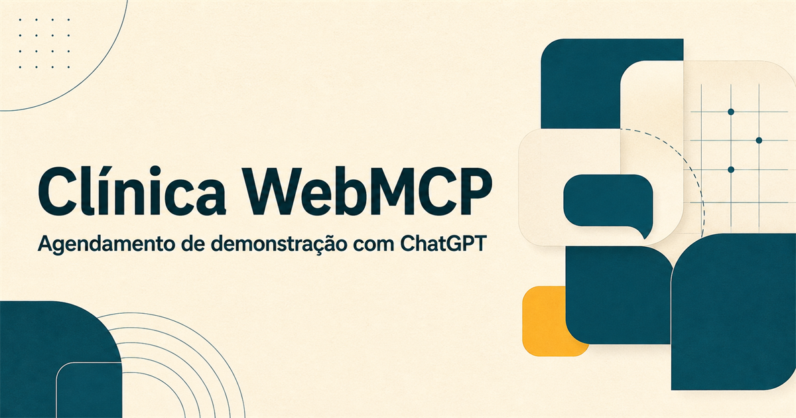
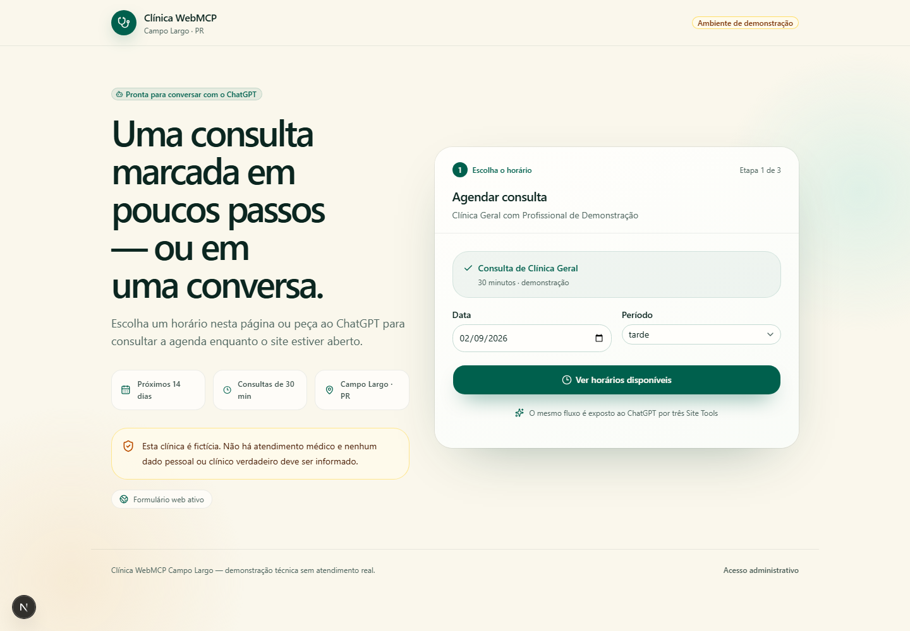
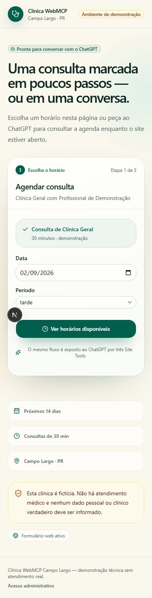

  

<h1 align="center">Clínica WebMCP Campo Largo</h1>

  <strong>Um MVP de clínica fictícia em que o mesmo agendamento funciona pelo site e, em um ambiente compatível, por uma conversa com o ChatGPT.</strong>

  
  
  
  
  

  <a href="https://clinica-webmcp-campo-largo-demo.vercel.app/"><strong>🌐 Abrir demonstração</strong></a>
  &nbsp;•&nbsp;
  <a href="https://clinica-webmcp-campo-largo-demo.vercel.app/openapi.json"><strong>📘 Ver OpenAPI</strong></a>
  &nbsp;•&nbsp;
  <a href="#teste-real-com-o-chatgpt"><strong>🤖 Testar no ChatGPT</strong></a>

> [!IMPORTANT]
> Esta é uma demonstração técnica. A clínica, o profissional, os pacientes e os agendamentos são fictícios. Não informe sintomas, documentos, prontuário, telefone verdadeiro ou qualquer dado pessoal/clínico real.

## A ideia

O projeto prova um fluxo simples e poderoso:

1. a clínica publica ferramentas estruturadas diretamente na página;
2. o ChatGPT Work ou o Codex, em um ambiente com **Site Tools/WebMCP**, descobre essas ferramentas enquanto o site está aberto;
3. o paciente conversa normalmente para consultar horários;
4. o ChatGPT mostra um resumo e espera um **“Confirmo”**;
5. somente depois da confirmação a API grava no Supabase;
6. a consulta aparece no painel administrativo com origem <code>webmcp</code>.

O formulário convencional usa a mesma API e as mesmas regras de negócio. Se WebMCP não estiver disponível, o site continua funcionando em desktop e celular.

## Veja o MVP funcionando

### Experiência desktop

  

### Experiência mobile

  

O formulário aparece logo no primeiro bloco, com seleção de data e período, horários de 30 minutos, revisão, aceite do ambiente fictício e confirmação final.

## O que já está pronto

| Área | Entrega |
|---|---|
| Paciente | Formulário responsivo em três etapas, estados de carregamento, conflito, indisponibilidade, erro e sucesso |
| ChatGPT | Três Site Tools registradas no documento principal por WebMCP |
| Agenda | Segunda a sexta, 09h–12h e 14h–17h, próximos 14 dias, fuso <code>America/Sao_Paulo</code> |
| Banco | Supabase/Postgres, migrations, seed determinístico e RLS |
| Segurança | Tokens HMAC de curta duração, idempotência, rate limit anonimizado e prevenção de sobreposição |
| Administração | Login protegido, listagem, origem <code>web</code>/<code>webmcp</code> e cancelamento |
| Deploy | Vercel com região preferencial <code>gru1</code> e Supabase isolado |
| Descoberta técnica | <code>/openapi.json</code>, metadados e três ferramentas WebMCP |
| Privacidade do MVP | <code>robots.txt</code> e <code>noindex,nofollow</code> ativos |
| Qualidade | Lint, typecheck, testes unitários, Playwright desktop/mobile e build de produção |

## Compatibilidade atual

WebMCP é a parte futurista do projeto, mas a compatibilidade precisa ser entendida corretamente:

| Onde o paciente está | Formulário web | Site Tools/WebMCP |
|---|:---:|:---:|
| Aplicativo desktop, navegador integrado, ChatGPT Work ou Codex, Site Tools habilitado e GPT-5.6 Sol/Terra | ✅ | ✅ |
| Navegador comum no desktop | ✅ | ❌ |
| Navegador comum no celular | ✅ | ❌ |
| ChatGPT normal no iPhone/Android | Pode abrir o site | ❌ nesta versão |

> [!NOTE]
> No ChatGPT móvel normal, a conversa ainda não consegue chamar automaticamente as ferramentas desta página. O fallback funcional é abrir a demonstração e agendar pelo formulário. Segundo a [documentação oficial de WebMCP/Site Tools](https://learn.chatgpt.com/docs/webmcp), o teste nativo atual requer o aplicativo desktop atualizado, o navegador integrado, ChatGPT Work ou Codex e GPT-5.6 Sol/Terra; a disponibilidade também depende do rollout e não inclui workspaces Enterprise/Edu.

Não há plugin para o paciente instalar no fluxo WebMCP, mas também não existe descoberta mágica por <code>robots.txt</code> ou <code>openapi.json</code>. A descoberta ocorre porque a página registra ferramentas em <code>document.modelContext</code>.

## Arquitetura

~~~mermaid
flowchart LR
    P["Paciente"] --> C{"Canal"}
    C -->|"Work ou Codex no desktop"| W["3 Site Tools WebMCP"]
    C -->|"Desktop ou celular"| F["Formulário Next.js"]
    W --> API["API server-side"]
    F --> API
    API --> D["Serviços de domínio"]
    D --> DB[("Supabase / Postgres")]
    ADM["Painel /admin"] --> AR["Rotas admin autenticadas"]
    AR --> D
~~~

- O navegador nunca consulta as tabelas diretamente.
- A chave secreta do Supabase existe somente no servidor.
- Formulário e WebMCP convergem para os mesmos endpoints.
- O domínio fica desacoplado do transporte, preparando uma futura camada de MCP remoto.

### Fluxo de confirmação pelo ChatGPT

~~~mermaid
sequenceDiagram
    actor P as Paciente
    participant G as ChatGPT
    participant W as WebMCP
    participant A as API Next.js
    participant S as Supabase

    P->>G: Quais horários existem amanhã à tarde?
    G->>W: buscar_horarios
    W->>A: GET /api/availability
    A->>S: Consulta a agenda
    S-->>G: Horários + tokens opacos
    G-->>P: Exibe as opções
    P->>G: Quero o primeiro horário
    G-->>P: Mostra o resumo e pede confirmação
    Note over G,W: Nenhuma consulta é criada nesta etapa
    P->>G: Confirmo
    G->>W: agendar_consulta
    W->>A: POST /api/appointments
    A->>S: Reserva transacional e idempotente
    S-->>P: Código e resumo da consulta
~~~

## As três ferramentas WebMCP

O componente [webmcp-registrar.tsx](src/components/webmcp-registrar.tsx) verifica a disponibilidade de <code>document.modelContext.registerTool</code> e registra exatamente:

| Ferramenta | Entrada principal | Resultado |
|---|---|---|
| <code>obter_dados_clinica</code> | nenhuma | clínica, cidade, aviso de demonstração e serviços |
| <code>buscar_horarios</code> | serviço, data inicial, período e quantidade | horários legíveis e tokens opacos assinados |
| <code>agendar_consulta</code> | token, nome, WhatsApp e confirmação explícita | código e resumo do agendamento |

<code>agendar_consulta</code> rejeita a operação se <code>confirmacao_explicita</code> não for <code>true</code>. A descrição da ferramenta também orienta o agente a apresentar o resumo antes de escrever no banco.

## Teste real com o ChatGPT

Use apenas dados fictícios.

1. Abra a [URL da demonstração](https://clinica-webmcp-campo-largo-demo.vercel.app/) no navegador integrado do aplicativo desktop atualizado, usando ChatGPT Work ou Codex com GPT-5.6 Sol/Terra.
2. Abra **Site tools → Available site tools** e confirme os três nomes da tabela acima.
3. Envie:

> Quais horários de clínica geral existem amanhã à tarde?

4. Escolha uma opção:

> Quero o primeiro horário para “Paciente Teste” e WhatsApp “(41) 90000-0000”. Mostre o resumo antes de agendar.

5. Verifique que nenhuma linha foi criada e então responda:

> Confirmo o agendamento demonstrativo.

6. Confira o código retornado e a origem <code>webmcp</code> no painel administrativo.
7. Repita a chamada para validar idempotência: o código deve permanecer o mesmo.
8. Tente o mesmo horário com outro paciente fictício: a API deve responder conflito.

### O que não funciona como descoberta

- pedir ao ChatGPT móvel normal apenas para “abrir o site e descobrir os endpoints”;
- esperar que <code>robots.txt</code> ensine ações ao modelo;
- tratar <code>openapi.json</code> como registro automático de ferramentas;
- tentar usar WebMCP sem manter a página aberta em um ambiente compatível.

## API

| Método | Rota | Finalidade |
|---|---|---|
| <code>GET</code> | <code>/api/clinic</code> | dados públicos da clínica e serviços |
| <code>GET</code> | <code>/api/availability</code> | horários disponíveis e tokens assinados |
| <code>POST</code> | <code>/api/appointments</code> | criação confirmada e idempotente |
| <code>GET</code> | <code>/api/health</code> | saúde da aplicação |
| <code>POST / DELETE</code> | <code>/api/admin/session</code> | login e logout administrativo |
| <code>GET</code> | <code>/api/admin/appointments</code> | listagem protegida |
| <code>POST</code> | <code>/api/admin/appointments/:id/cancel</code> | cancelamento protegido |
| <code>GET</code> | <code>/openapi.json</code> | documentação técnica |

Respostas usam <code>400</code> para dados inválidos, <code>401</code> para acesso administrativo não autenticado, <code>409</code> para horário ocupado e <code>429</code> para excesso de tentativas.

## Banco de dados

A migration [202609010001_clinic_mvp.sql](supabase/migrations/202609010001_clinic_mvp.sql) cria:

- <code>clinics</code>;
- <code>services</code>;
- <code>professionals</code>;
- <code>professional_services</code>;
- <code>weekly_availability</code>;
- <code>appointments</code>;
- <code>rate_limits</code>;
- funções transacionais de reserva e rate limiting.

Todas as entidades de negócio possuem <code>clinic_id</code>. O seed ativa Clínica Geral com um profissional fictício e deixa a estrutura pronta para novas especialidades. As tabelas têm RLS e não concedem leitura pública direta a <code>anon</code> ou <code>authenticated</code>.

## Segurança e integridade

- tokens de horário assinados por HMAC e válidos por 10 minutos;
- rejeição de tokens adulterados, expirados ou referentes a horários inválidos;
- reserva transacional no Postgres com prevenção de sobreposição;
- idempotência para repetição da mesma chamada sem duplicar consultas;
- limite básico por IP anonimizado e contato;
- sessão administrativa em cookie assinado, <code>HttpOnly</code>, <code>Secure</code> em produção e com expiração;
- segredos nunca prefixados com <code>NEXT_PUBLIC_</code>;
- nome e telefone não são escritos nos logs da aplicação;
- cancelamento devolve o horário à disponibilidade.

> [!WARNING]
> Para uma clínica real ainda seriam necessários autenticação individual, auditoria, consentimento e política de privacidade, revisão jurídica/LGPD, gestão de profissionais, observabilidade e um provedor de mensagens.

## Executar localmente

Pré-requisito: Node.js 20 ou superior.

~~~powershell
npm install
Copy-Item .env.example .env.local
npm run dev
~~~

Abra <http://localhost:3000>.

Se <code>SUPABASE_URL</code> e <code>SUPABASE_SECRET_KEY</code> estiverem vazios em desenvolvimento, a aplicação usa um repositório em memória. Isso permite testar o front imediatamente, sem criar infraestrutura.

Dados fictícios sugeridos:

- nome: <code>Paciente Teste</code>;
- WhatsApp: <code>(41) 90000-0000</code>.

## Variáveis de ambiente

Copie [.env.example](.env.example) e configure:

| Variável | Uso |
|---|---|
| <code>SUPABASE_URL</code> | URL do projeto Supabase |
| <code>SUPABASE_SECRET_KEY</code> | chave secreta somente do servidor |
| <code>APP_SIGNING_SECRET</code> | assinatura dos tokens e hashes do rate limit |
| <code>ADMIN_PASSWORD</code> | senha do painel administrativo |
| <code>ADMIN_SESSION_SECRET</code> | assinatura da sessão administrativa |
| <code>SITE_URL</code> | URL canônica, sem barra no final |
| <code>ALLOW_SEARCH_INDEXING</code> | deve permanecer <code>false</code> neste MVP fictício |

Gere valores longos e diferentes para cada segredo. O [.gitignore](.gitignore) mantém arquivos <code>.env*</code> fora do Git e libera somente o modelo seguro <code>.env.example</code>.

## Configurar o Supabase

1. Crie um projeto novo e isolado, preferencialmente em São Paulo.
2. Faça login, vincule o projeto e aplique a migration:

~~~powershell
npx supabase login
npx supabase link --project-ref SEU_PROJECT_REF
npx supabase db push
~~~

3. Copie a URL e uma chave secret/service-role somente de servidor para <code>.env.local</code>.

~~~dotenv
SUPABASE_URL=https://SEU_PROJECT_REF.supabase.co
SUPABASE_SECRET_KEY=SEU_SEGREDO_DE_SERVIDOR
~~~

## Implantar na Vercel

Depois de configurar o Supabase:

~~~powershell
npx vercel login
npx vercel
~~~

Adicione as sete variáveis de ambiente ao projeto na Vercel. Use a URL final em <code>SITE_URL</code> e publique:

~~~powershell
npx vercel --prod
~~~

O [vercel.json](vercel.json) define a região preferencial <code>gru1</code>. Em produção, a aplicação falha de propósito se credenciais ou segredos obrigatórios estiverem ausentes.

## Testes

~~~powershell
npm run lint
npm run typecheck
npm test
npm run test:coverage
npm run test:e2e
npm run build
~~~

O conjunto atual cobre schemas, telefone, fuso horário, assinatura e expiração de tokens, horários passados/ocupados, conflito concorrente, idempotência, cancelamento, rate limiting, sessão administrativa, registro das Site Tools e fluxos de interface desktop/mobile.

## Estrutura principal

~~~text
src/
├── app/
│   ├── api/                 # rotas públicas e administrativas
│   ├── admin/               # painel protegido
│   ├── openapi.json/        # documentação da API
│   └── page.tsx             # experiência do paciente
├── components/
│   ├── appointment-flow.tsx
│   └── webmcp-registrar.tsx
└── lib/                     # domínio, banco, segurança e validação

supabase/
└── migrations/              # schema, funções, RLS e seed

tests/
├── unit/
└── e2e/
~~~

## Próximos passos

- adicionar mais especialidades e profissionais via dados, sem duplicar o fluxo;
- substituir a senha única por autenticação individual e trilha de auditoria;
- adicionar notificações transacionais;
- criar uma camada de MCP remoto quando o canal móvel escolhido suportar essa integração;
- transformar a demonstração em produto real com requisitos de LGPD e operação clínica;
- executar testes de contrato e observabilidade contínua em produção.

---

  <strong>Uma prova de conceito pequena para uma ideia grande:</strong> 
  sites deixando de ser apenas páginas e passando a oferecer ações seguras para agentes de IA.

